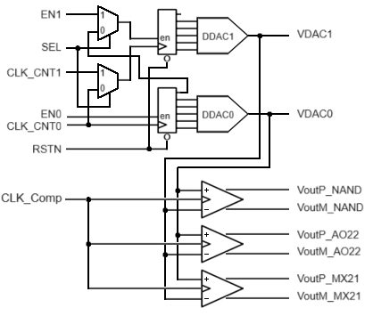

<!---

This file is used to generate your project datasheet. Please fill in the information below and delete any unused
sections.

You can also include images in this folder and reference them in the markdown. Each image must be less than
512 kb in size, and the combined size of all images must be less than 1 MB.
-->

## How it works

This project implements three different analog comparators based on standard logic cells.

Two DACs, also implemented using only standard logic cells, with the aid of two 5-bit counters, generate an analog ramp signal to test the comparators.

## How to test

The SEL pin alows to select two different test conditions. With SEL=0, both counters work together, generating a 10-bit sequence. For each step in the DAC1, DAC0 generates 32 different voltage levels, from near 0V to near Vcc. With SEL=1, both counters work independently.

## External hardware

It's necessary an osciloscope to visualize the outputs from the DACs and the comparators. 
